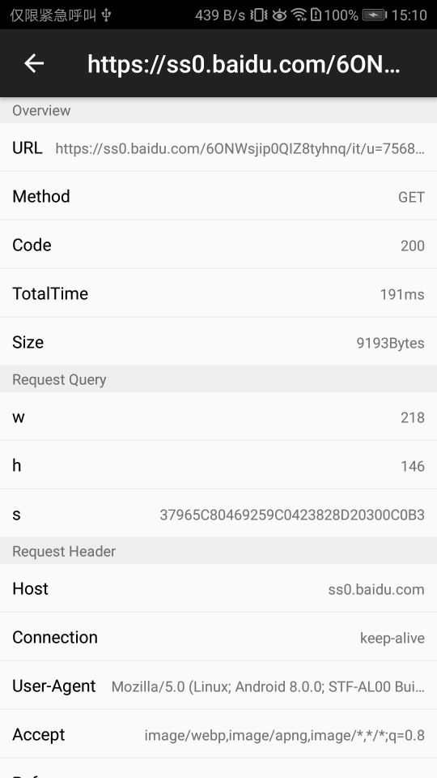

<div align="center">

## HttpCanary

**`Android`Crash日志打印输出**

[ ](https://bintray.com/guxiaonian/httpcanary/httpcanary/_latestVersion)
[](https://github.com/guxiaonian/HttpCanary/issues)
[](https://github.com/guxiaonian/HttpCanary/network)
[](https://github.com/guxiaonian/HttpCanary/stargazers)
[](http://www.apache.org/licenses/LICENSE-2.0)

</div>
<br>

# 效果展示





# 依赖

```gradle
debugImplementation  'fairy.easy.httpcanary:httpcanary:{latestVersion}'
releaseImplementation  'fairy.easy.httpcanary:httpcanary-no-op:{latestVersion}'
//androidX使用
//debugImplementation  'fairy.easy.httpcanary:httpcanary-androidx:{latestVersion}'

```
      
# 调用方式

```java
public class App extends Application {

    @Override
    public void onCreate() {
        super.onCreate();
        HttpCanary.install(this);
    }
}

```

# 注意事项

1. targetSdkVersion设置为28以下
2. 添加1.8版本

```gradle
 compileOptions {
        targetCompatibility 1.8
        sourceCompatibility 1.8
    }
```
